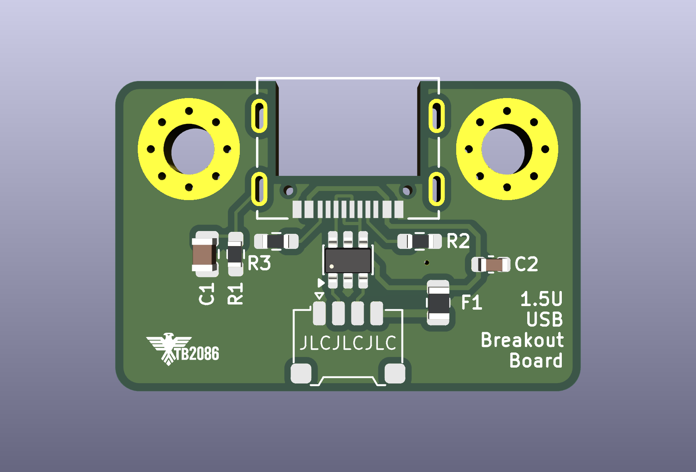
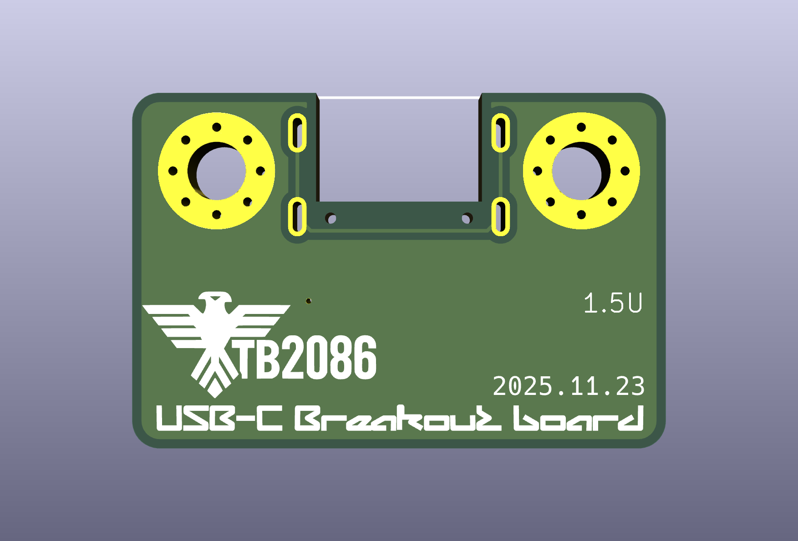
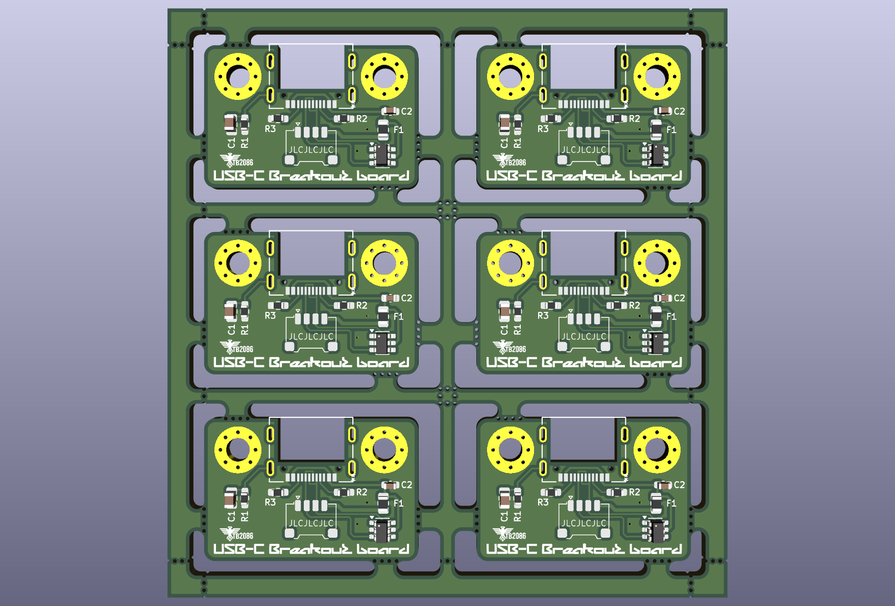

# TB2086 USB-C Breakout Board

A compact USB-C breakout board designed for keyboard projects. This repository contains KiCad design files, production outputs, and documentation for the TB2086-USB-C panelized PCB.

## Features
* USB-C receptacle for modern connectivity
* 1.5U size for keyboard compatibility

## Bill of Materials (BOM)

| Comment                | Designator   | Footprint                                         | LCSC         | Quantity |
|------------------------|--------------|---------------------------------------------------|--------------|----------|
| 4.7n                   | C1           | C_0805_2012Metric                                 | C16036       | 1        |
| 10u                    | C2           | C_0603_1608Metric                                 | C19702       | 1        |
| 500mA                  | F1           | Fuse_0805_2012Metric                              | C66452       | 1        |
| 1M                     | R1           | R_0603_1608Metric_Pad0.98x0.95mm_HandSolder       |              | 1        |
| 5K1                    | R2, R3       | R_0603_1608Metric_Pad0.98x0.95mm_HandSolder       | C22356620    | 2        |
| USBLC6-2SC6            | U1           | SOT-23-6                                          | C2827654     | 1        |
| Conn_01x04             | J1           | Molex_Pico-EZmate_78171-0004_1x04-1MP_P1.                        | 1        |
| USB_C_Receptacle_USB2.0_16P | USB1    | TYPE-C-31-M-14_HRO (mid mount)                    |              | 1        |

## Assembly Notes
- All footprints are hand-solderable
- Refer to schematic for signal mapping

